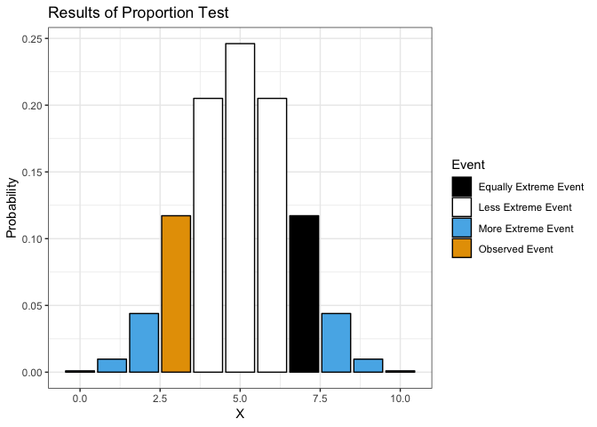
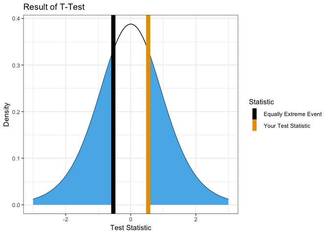
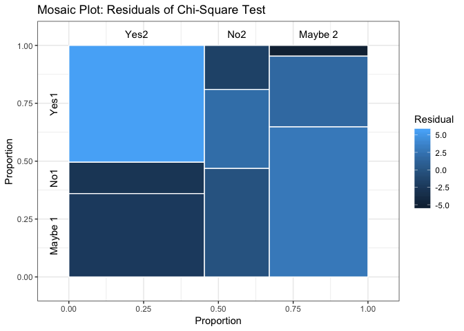
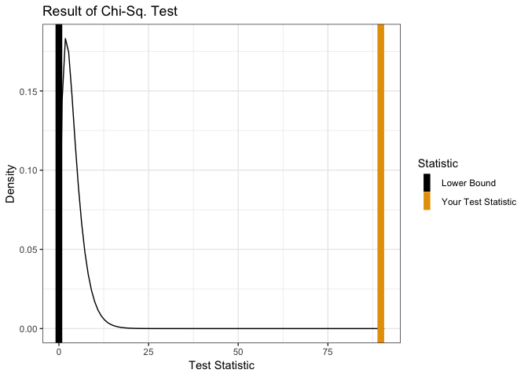
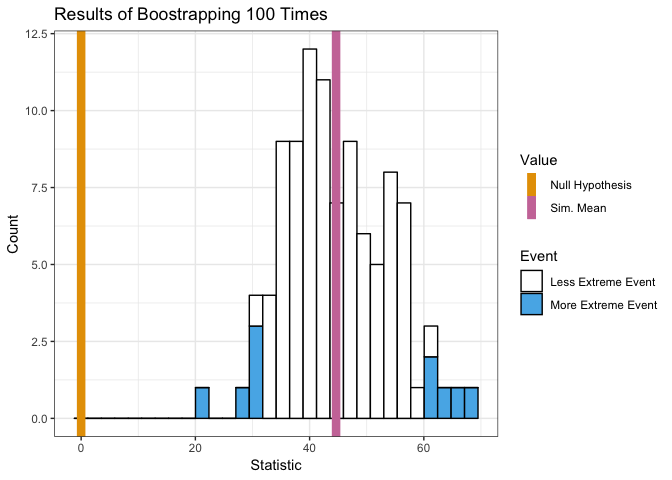
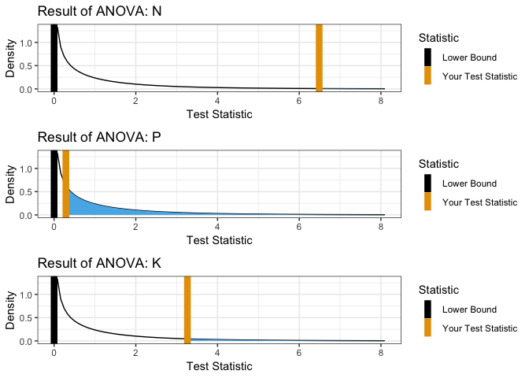

mcStats
================

This package is used to visualize the sampling distributions of test statistics for various hypothesis tests common in introductory statistics courses. We have found that students are typically capable of interpreting p-values in the context of a hypothesis test. However, students often struggle with the connection between the probability of observing the given test statistic and its corresponding sampling distribution. The stats package performs statistical tests while mcStats visualizes the resulting sampling distribution and p-value.

Hypothesis Tests
================

Proportion Test
---------------

``` r
showProp.Test(3, 10)
```



    ## 
    ##  Exact binomial test
    ## 
    ## data:  x and n
    ## number of successes = 3, number of trials = 10, p-value = 0.3438
    ## alternative hypothesis: true probability of success is not equal to 0.5
    ## 95 percent confidence interval:
    ##  0.06673951 0.65245285
    ## sample estimates:
    ## probability of success 
    ##                    0.3

T-Test
------

### One Sample

Test with null hypothesis mean = 0.

``` r
set.seed(1)
x <- rnorm(10)
showT.Test(x)
```



    ## 
    ##  One Sample t-test
    ## 
    ## data:  group1
    ## t = 0.53557, df = 9, p-value = 0.6052
    ## alternative hypothesis: true mean is not equal to 0
    ## 95 percent confidence interval:
    ##  -0.4261948  0.6906003
    ## sample estimates:
    ## mean of x 
    ## 0.1322028

Test with nullhypothesis mean = 0.5.

``` r
showT.Test(x, mu = 0.5)
```


    ## 
    ##  One Sample t-test
    ## 
    ## data:  group1
    ## t = -1.49, df = 9, p-value = 0.1704
    ## alternative hypothesis: true mean is not equal to 0.5
    ## 95 percent confidence interval:
    ##  -0.4261948  0.6906003
    ## sample estimates:
    ## mean of x 
    ## 0.1322028

### Two Sample

    y <- rnorm(10, mean = 0.1)
    showT.Test(x,y)

Chi-Square Test
---------------

### Mosaic Plot

``` r
x <- matrix(runif(9,5,100), ncol = 3, dimnames = list(c("Yes1", "No1", "Maybe 1"),
                                                      c("Yes2", "No2", "Maybe 2")))
plt <- showMosaicPlot(x)
```



### Distribution

``` r
showChiSq.Test(x)
```



    ## 
    ##  Pearson's Chi-squared test
    ## 
    ## data:  x
    ## X-squared = 89.75, df = 4, p-value < 2.2e-16

McNemar Test
------------

``` r
Performance <-
  matrix(c(794, 86, 150, 570),
         nrow = 2,
         dimnames = list("1st Survey" = c("Approve", "Disapprove"),
                         "2nd Survey" = c("Approve", "Disapprove")))
showMcNemarTest(Performance)
```


    ## 
    ##  McNemar's Chi-squared test with continuity correction
    ## 
    ## data:  x
    ## McNemar's chi-squared = 16.818, df = 1, p-value = 4.115e-05

Bootstrap
=========

``` r
bootstrap(mean, x, 0, 100)
```



    ##   [1] 36.36187 38.15891 42.89708 49.93433 36.75566 34.47572 42.50320
    ##   [8] 37.51818 47.01475 41.90597 34.15828 61.16976 40.75795 41.95468
    ##  [15] 51.96017 35.16819 43.42145 30.55734 61.14388 42.07116 57.67997
    ##  [22] 53.20239 30.66014 35.80705 39.02232 54.47003 47.47221 39.62905
    ##  [29] 38.88452 55.11086 46.61004 44.41364 54.25721 51.37956 38.71093
    ##  [36] 35.27002 59.88889 38.32205 39.12065 47.72615 45.17838 43.88637
    ##  [43] 45.72776 30.66330 56.63671 60.47683 50.39609 51.94355 40.41378
    ##  [50] 35.76772 39.74028 44.91133 44.83735 30.32962 27.27879 53.31046
    ##  [57] 43.45531 39.19167 57.39400 39.93620 42.81339 48.89230 43.06545
    ##  [64] 39.56437 52.02378 33.06948 46.51049 54.80996 57.43729 32.22652
    ##  [71] 45.16022 21.75690 37.13076 48.82128 45.99481 37.61065 39.20117
    ##  [78] 41.97044 55.49622 32.76124 33.97069 34.21117 40.62334 42.74676
    ##  [85] 53.49169 50.04009 36.50908 46.35691 36.48568 50.87772 47.02740
    ##  [92] 53.81886 56.84332 46.14512 68.30618 56.58807 48.65618 65.52212
    ##  [99] 36.79391 63.16242

ANOVA
=====

``` r
showANOVA(yield ~  N + P + K, npk)
```



OLS
===

``` r
showOLS(mpg ~ cyl + disp, mtcars)
```


